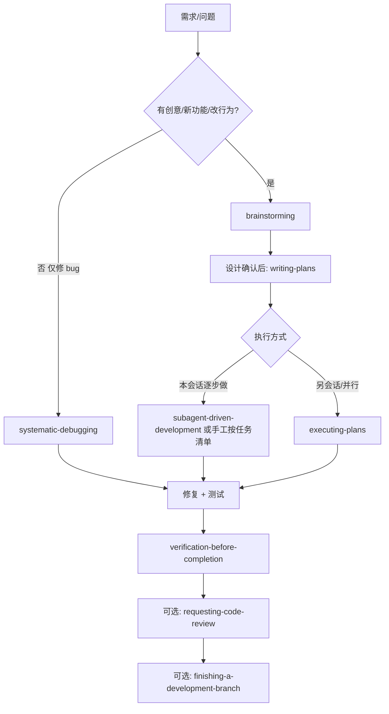

# 业务流程（Superpowers）

本仓库的**默认工作流**对齐 Cursor Superpowers 技能族：先流程、后实现；有证据再声称完成。技能原文在本地 Cursor 插件目录（`superpowers`）；此处只约定 **在本仓库里如何落地**。

**优先级（与 using-superpowers 一致）：** 用户明确指令（含本仓库 `AGENTS.md`）> Superpowers 流程 > 默认模型行为。

## 总览

## 阶段说明

### 1. 启动：是否适用技能（using-superpowers）

- 任意任务前先问：**是否有任一 Superpowers 技能可能适用**（哪怕约 1%）。适用则按该技能执行。
- **技能顺序：** 先 **流程类**（brainstorming、systematic-debugging），再 **实现类**（TDD、领域技能）。
- **Cursor：** 通过阅读技能 `SKILL.md` 或让用户点名技能；没有 Claude Code 的 `Skill` 工具时，以 `AGENTS.md` + 本文为准。

### 2. 新功能 / 改行为 / 组件级工作：brainstorming（硬门槛）

- **在给出可落地的实现或写代码之前**：理清意图、约束、验收标准；给出方案对比；用户认可设计。
- **简单任务也要过一遍**：设计可以很短，但不能跳过「呈现设计 → 用户同意」。
- **产出（建议路径）：** `docs/superpowers/specs/YYYY-MM-DD-<topic>-design.md`  
  （与 writing-plans / brainstorming 技能中的默认路径一致；若团队另定目录，以 `AGENTS.md` 为准。）

### 3. 多步骤实现前：writing-plans

- **何时：** 已有需求/规格，且会改多处代码或跨多天。
- **做什么：** 拆成可验证的小任务；写明要动哪些文件、如何测；计划头与 checkbox 格式见技能原文。
- **产出路径（默认）：** `docs/superpowers/plans/YYYY-MM-DD-<feature-name>.md`  
  用户若指定其他目录，从其指定。

### 4. 执行计划

| 场景 | 技能 |
|------|------|
| 同一会话、任务相对独立 | **subagent-driven-development**（或按 checkbox 手工执行） |
| 适合另开会话/并行执行 | **executing-plans** |
| 实现功能且适合红绿循环 | **test-driven-development**（技能要求严格时照做） |

### 5. Bug / 测试失败：systematic-debugging

- 先系统排查再改代码；避免未复现就「应该好了」。

### 6. 声称完成前：verification-before-completion（铁律）

- **无新鲜运行结果，不得声称**「通过」「完成」「修好了」。
- 本仓库默认验证命令见 [AGENTS.md](../../AGENTS.md)「Testing」与「业务流程」小结。
- 原则：**先跑完整命令 → 读退出码与输出 → 再下结论**。

### 7. 合并与收尾（可选）

- **requesting-code-review** / **receiving-code-review**：合并前评审。
- **finishing-a-development-branch**：分支收尾、合并或 PR 选项。

## 与本仓库文档的对应关系

| 用途 | 路径 |
|------|------|
| 设计备忘（brainstorming 后） | `docs/superpowers/specs/` |
| 实施计划（writing-plans） | `docs/superpowers/plans/` |
| 执行中任务 | `docs/exec-plans/active/`（可与计划交叉引用） |
| 已完成归档 | `docs/exec-plans/completed/` |
| 技术债 | [exec-plans/tech-debt-tracker.md](../exec-plans/tech-debt-tracker.md) |

## 反模式（摘自 using-superpowers）

- 「先随便看下代码再选技能」→ 应先判断技能再探索。
- 「太简单不用设计」→ brainstorming 仍要，可极短。
- 「应该能过」→ 未运行验证命令则不得声称通过。
